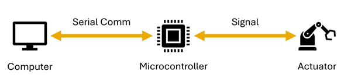
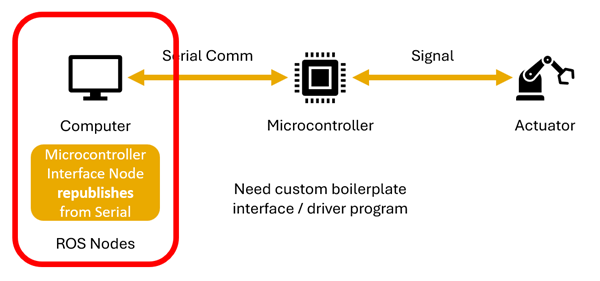

  

## The ROS-to-Actuator Pipeline

Without a way to talk to actuators, ROS quickly becomes very limited in use. First, we need to think about how a computer might talk to an actuator.

_The ROS-to-Actuator Pipeline_

Oftentimes, the computer communicates with a microcontroller over a serial connection, though there are alternative methods as we will see later. In this particular case, the computer communicates to the microcontroller over a serial connection, and the microcontroller then typically interfaces with the actuator over an even lower-level communication.

_The pipeline with the computer-side node approach_

One option is to have the computer have a custom interface program running on it. This program would be a ROS node which translates relevant information from the topics into serial messages to the microcontroller. This is often the approach used for commercial hardware.

![[clip_image006.png]]

_The pipeline with the microcontroller-side node apparoch_

Another option is for the microcontroller to have a ROS node running on it, with a specialized program on the computer forwarding any and all messages over serial from ROS nodes into the ROS network. In ROS 1, a similar approach was used with rosserial but a process had to be run on the host machine for each microcontroller. In ROS 2, a single program handles all ROS microcontrollers with micro-ROS.

## What is micro-ROS?

micro-ROS is the out-of-the-box software for interfacing microcontrollers with ROS 2. Unlike its predecessor, it does require higher performance microcontrollers.

## Setting up a micro-ROS development

### micro-ROS for Arduino and Teensy

### micro-ROS for Raspberry Pi Pico

More experienced developers may opt for a more classical development experience. The Raspberry Pi Pico is one board that requires a more hands-on compiling process.

### Setting up the micro-ROS agent on the computer

### Using the /dev directory and determining which device is which

### An Example Workflow

## Resources and Tips

The ROS ecosystem is constantly evolving, and the best way to get up-to-date information is at the source – as in the source code. The GitHub repositories for micro-ROS projects are public. In the case of Arduino, there are example code samples provided which are a great starting point for writing new programs. GitHub Issues are a great place to look if you have a strange problem that you are unsure how to solve. It could be a problem someone else has had before!

Generally, when installing software which depends on other software, it is good to install versions which were released concurrently. For example, if installing micro-ROS-arduino Humble, it is important to install the version of Teensyduino which was released at the same time. Installing an earlier version of one with the latest version of the other will likely result in compiler errors.

## Exercises

Exercise 1: Implement a micro-ROS node with a publisher and subscriber. A framework for Arduino is provided at the following GitHub link:

Exercise 2: Use micro-ROS to set a servo position. A framework for Arduino is provided at the following GitHub link: